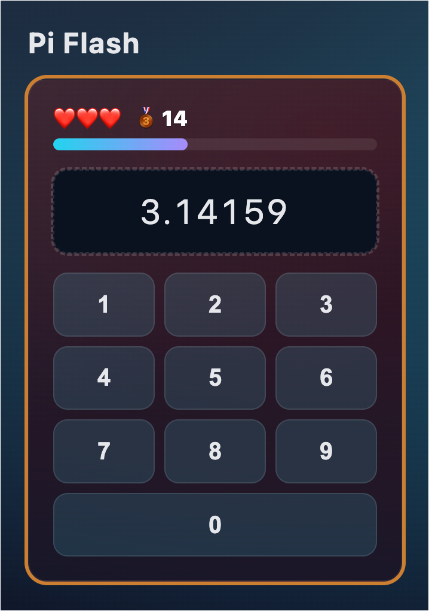

# Pi Flash — webxdc memory challenge

Memorize and reproduce the digits of π. The sequence grows one digit each successful round. You get 3 lives; a mistake or a timeout costs one. How far can you go?



## Gameplay

1. A new digit is revealed (bold) at the end of the current known prefix of π (displayed as `3.1415…`).
2. Digits are briefly shown, then hidden.
3. Enter the sequence using the on‑screen keypad (no backspace—instant validation per digit).
4. Finish the full sequence to advance; a wrong digit or time expiry loses a life.
5. Lose all 3 lives → Game Over.

## Current Features

- Progressive memory loop with per‑digit immediate validation.
- Automatic formatting: first digit then decimal (3.x) for readability.
- Lives system (❤️ hearts) with animated loss overlay (pop + grayscale) and delayed final Game Over reveal.
- Milestones at 10 / 20 / 30 digits:
	- Medal icon next to score (🥉 / 🥈 / 🥇)
	- Confetti celebration at first milestone (10)
	- Background theme shifts by tier.
- Floating emoji feedback (👍, 🏆) for correct rounds & milestones.
- Haptic & visual keypad feedback (press pulse, shake on error, vibration patterns where supported).
- Timer bar with per-round calculated time (base + per‑digit).
- Local best score persistence via `localStorage`.
- Optional debug start length field for quick testing.
- Internationalization (auto‑detected via `navigator.language`) with fallback to English.
	- Languages: English (en), French (fr), German (de), Spanish (es), Polish (pl), Norwegian (no), Portuguese (pt).
- Game Over update broadcast via `webxdc.sendUpdate` with score summary.

## Tech & Structure

| File | Purpose |
|------|---------|
| `src/index.html` | Markup/screens (start, round, game over) + keypad |
| `src/main.js` | State machine, timing, input handling, animations, confetti, i18n apply |
| `src/styles.css` | Layout, themes, animations (hearts, keypad, confetti) |
| `src/i18n.js` | Translation dictionary & helper |
| `src/manifest.toml` | webxdc metadata |

No external runtime dependencies; pure HTML/CSS/JS.

## Development

Run with the webxdc dev tool:

```sh
webxdc-dev run src
```

This launches the simulator. Open the console for logs if needed. Use the debug input on the start screen to jump to a higher starting length for testing long sequences.

### Hot Reload Note
If your environment doesn’t auto‑reload, re-run or refresh manually after edits.

## Packaging (.xdc)

Create a distributable `.xdc` (zip of `src` contents):

```sh
mkdir -p dist && (cd src && zip -9 --recurse-paths - *) > dist/pi-flash.xdc
```

Share `dist/pi-flash.xdc` in any Delta Chat / webxdc compatible client.

## Customization

- Adjust milestone thresholds: edit `MILESTONES` in `main.js`.
- Add more digits of π: extend `PI_SOURCE` string.
- Add languages: extend `i18n.js` object (two‑letter code) and translations.
- Tune animations: see keyframes in `styles.css` (`heart-pop`, `pad-fail`, confetti).

## Roadmap / Ideas

- Bonus prediction rounds (guess next unseen digit) for bonus points.
- Global high‑score merging via received updates.
- Optional sound effects (correct, wrong, milestone fanfare).
- Accessibility: larger text mode toggle for long sequences.

## License

MIT (adjust if you add assets requiring attribution).

---
Made for the webxdc platform. Have fun memorizing π! 🥧
